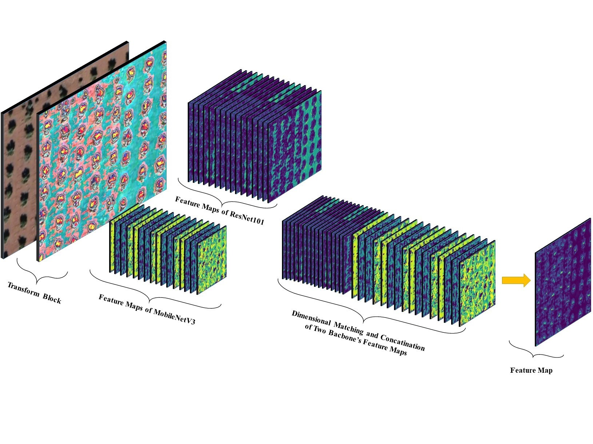
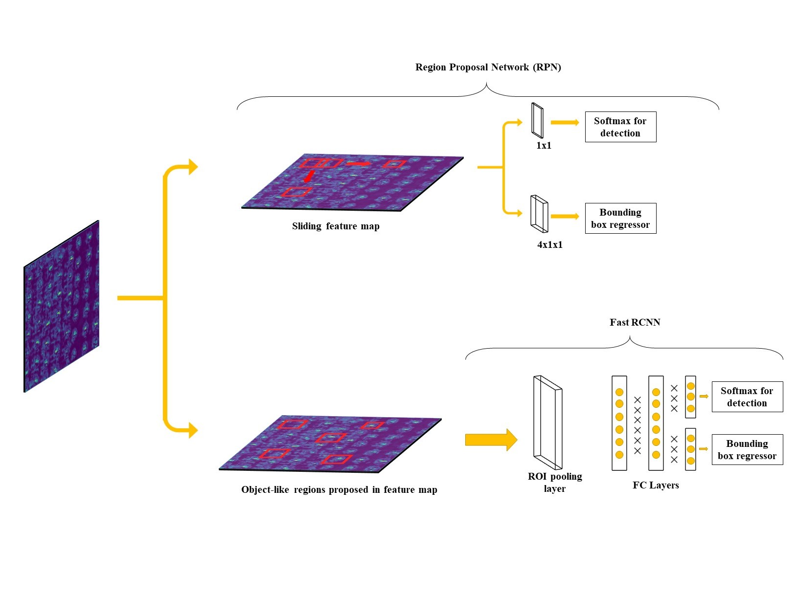

  
  

# Tree Detection from Satellite Images via Merged CNN Models

This repository contains the code and thesis for the project titled **"Tree Detection from Satellite Images via Merged CNN Models."** This project enhances the accuracy and efficiency of tree detection in aerial images by using a dual-backbone architecture that combines MobileNetV3 and ResNet101 within the Faster R-CNN framework.

## Project Overview
As of 2023, Turkey's total forest area is approximately 23.245 million hectares, accounting for 29.8% of the country's total land area. This project addresses the need for accurate tree detection in large-scale aerial imagery to support sustainable forest management. The merged MobileNetV3 and ResNet101 backbones are employed to provide a balance between computational efficiency and detection accuracy.

## Model Architecture
The architecture consists of a dual-backbone model that merges the features of MobileNetV3 and ResNet101 to improve the performance of the Faster R-CNN network:
- The first image illustrates the feature extraction process using MobileNetV3 and ResNet101 backbones.
- The second image demonstrates the region proposal and detection process within the Faster R-CNN framework, utilizing the merged feature maps.

## Key Features
- **Dual-Backbone Architecture**: Combines MobileNetV3 and ResNet101 for enhanced tree detection accuracy and efficiency.
- **Dataset**: Utilizes multiple datasets including the Turkey Dataset and the Oil Palm Tree Detection Dataset.
- **Performance Metrics**: Evaluates models using mean Average Precision (mAP) across various thresholds.
- **Optimized for Environmental Monitoring**: Aids in forest conservation efforts by providing an accurate tree detection system.

## Files
- `FasteRCNNAndWithMergedBackbones.ipynb`: Jupyter Notebook containing the implementation of the merged Faster R-CNN model with MobileNetV3 and ResNet101 backbones for tree detection.
- `TreeDetectionfromSatelliteImagesviaMergedCNNModels.pdf`: Thesis document detailing the project, including the methodology, results, and analysis.
- `images/modelarchitecture_1.jpg`: Diagram illustrating the feature extraction process using MobileNetV3 and ResNet101.
- `images/modelarchitecture.jpg`: Diagram demonstrating the region proposal and detection process in Faster R-CNN.

## Methodology
- **Data Processing**: The datasets contain aerial images labeled for tree detection, including various geographical formations and tree densities.
- **Model Training**: The model is trained using the Faster R-CNN framework with a combination of MobileNetV3 and ResNet101 as backbones.
- **Evaluation**: Performance is measured using mAP scores across various Intersection over Union (IoU) thresholds.

## Results
- The merged MobileNetV3 + ResNet101 model demonstrates significant improvements in detection accuracy and computational efficiency, achieving high mAP scores across different datasets.
- The findings underscore the importance of advanced deep learning techniques in promoting ecological balance and forest conservation.

## Citation
If you find this work useful, please consider citing the thesis:
